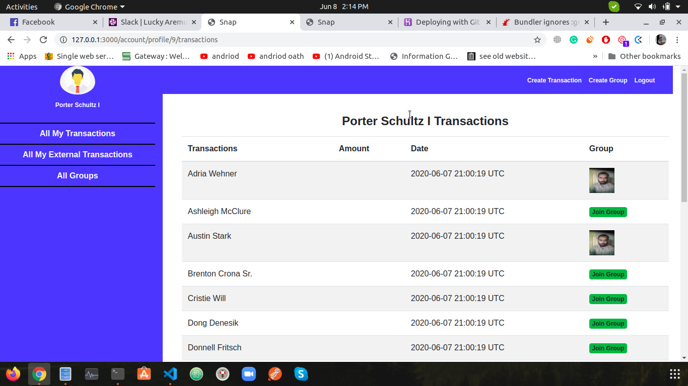

# SnapScan

- This is a website for managing you expenses   
# What it does
- Create Transaction
- Create Group
- Add Transaction in groups
# Built With
- Ruby
- Ruby on Rails
- VSCode

## Live Demo

[Live Demo Link](https://shrouded-dawn-33211.herokuapp.com/)

## Presentation

[presentation](https://www.loom.com/share/0f8c98c20e4945b695b456be0aef070f)

## Author

👤 **Tahir Ahmad**

- Github: [@tahirbhalli](https://github.com/Tahirbhalli)
- Twitter: [@tahirbhalli](https://twitter.com/tahirbhalli)
- Linkedin: [Tahir Ahmad](https://www.linkedin.com/in/tahir-ahmad-483035164/)

# 🤝 Contributing
Contributions, issues and feature requests are welcome!

# Show your support
Give a ⭐️ if you like this project!

📝 License

Check out my stories on medium to see what I'm talking about! Follow me on Instagram and Twitter to see what I am up to!

Enjoy!